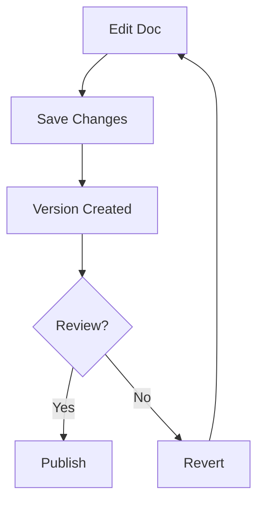

## Overview

Harsh Savani provides a comprehensive set of tools to streamline your documentation workflow. You can organize projects into intuitive folder structures, edit documents with rich formatting options, collaborate seamlessly with teams, and maintain version history to track changes over time. These features ensure your documentation stays current and accessible.

<Callout kind="info">
Start by creating a new project folder to organize your docs efficiently.
</Callout>

## Key Features

Discover the core capabilities at a glance.

<Columns cols={2}>
  <Card title="Project Organization" icon="folder" href="#project-organization">
    Structure your documentation with nested folders and intuitive navigation.
  </Card>
  <Card title="Rich Editing" icon="edit-3" href="#document-editing">
    Format content using Markdown, MDX, and interactive components.
  </Card>
  <Card title="Team Collaboration" icon="users" href="#collaboration">
    Share docs, add comments, and review changes in real-time.
  </Card>
  <Card title="Version Control" icon="git-branch" href="#version-control">
    Track revisions, revert changes, and maintain a complete history.
  </Card>
</Columns>

## Project Organization and Folder Structures

Organize your documentation projects using flexible folder hierarchies. Create root folders for major initiatives, subfolders for components, and nest further for detailed guides.

### Set Up Your Folder Structure

Follow these steps to get started:

<Steps>
  <Step title="Create a Project Folder" icon="folder-plus">
    Navigate to the dashboard and click `New Folder`. Name it after your project, such as `MyApp-Docs`.
  </Step>
  <Step title="Add Subfolders" icon="folder">
    Right-click the project folder and select `New Subfolder`. Create sections like `guides/`, `api/`, and `changelog/`.
  </Step>
  <Step title="Upload or Create Docs" icon="file-plus">
    Drag and drop Markdown files or use `New Document` to start fresh.
  </Step>
</Steps>

Example folder structure:

````json
{
  "MyApp-Docs": {
    "guides": ["quickstart.mdx", "features.mdx"],
    "api": ["endpoints.mdx", "authentication.mdx"],
    "changelog": ["releases.mdx"]
  }
}
````

## Document Editing and Formatting Options

Edit documents with powerful Markdown and MDX support. Use headings, lists, tables, and custom components for interactive content.

<Tabs>
  <Tab title="Markdown Basics" icon="edit">
    Standard formatting for quick edits.

````markdown
## Heading

- List item
- Another item

| Feature | Description |
|---------|-------------|
| Bold    | **Text**   |
````

  </Tab>
  <Tab title="MDX Components" icon="code">
    Embed interactive elements.

    <Callout kind="tip">
      Wrap special characters like `{variable}` in backticks for proper rendering.
    </Callout>

````jsx
<Card title="Example" icon="star">
  Interactive content here.
</Card>
````

  </Tab>
</Tabs>

## Collaboration and Sharing Features

Invite team members to collaborate on docs. Share public links for read-only access or enable editing permissions.

### Share a Document

1. Open your document.
2. Click `Share` in the top bar.
3. Select `Public Link` or `Invite Users`.
4. Set permissions: view, edit, or comment.

<CodeGroup tabs="Invite,Public Link">
  ```bash
  # Invite via email
  Invite: team@example.com (Editor)
  ```
  ```text
  # Public read-only link
  https://docs.harshsavani.com/myapp/quickstart
  ```
</CodeGroup>

## Version Control for Docs

Harsh Savani automatically tracks changes with built-in version history. View diffs, restore previous versions, and branch for experiments.

<Expandable title="Advanced Version Workflow" default-open="false">



Restore a version:

````bash
# From UI: History > Select Version > Restore
git-like: docs revert v1.2.0
````

</Expandable>

<Callout kind="tip" title="Best Practice">
Commit meaningful changes with descriptions like `Add authentication guide` for easy tracking.
</Callout>